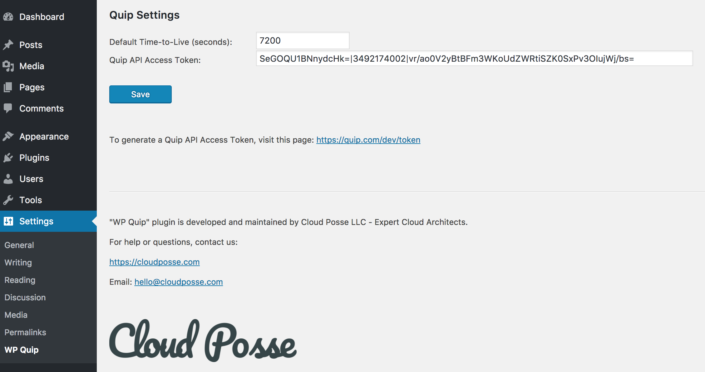

# wp-quip

[Quip](https://quip.com/) integration for WordPress


## Introduction

`WP Quip` plugin uses WordPress shortcodes to embed [Quip](https://quip.com/) documents into WordPress pages and blog posts.

https://codex.wordpress.org/Shortcode

https://codex.wordpress.org/Shortcode_API


## Installation

1. Upload `wp-quip` folder to the `/wp-content/plugins/` directory

2. Activate the `WP Quip` plugin through the `Plugins` menu in WordPress

3. On `Quip Settings` page (menu `Settings/WP Quip`), you can update the default value for `Time-to-Live` (see [Usage](#usage) for more details)

4. On `Quip Settings` page, enter and save `Quip API Access Token`


> To generate a Quip API Access Token, visit this page: https://quip.com/dev/token . Whenever you generate a new token, all previous tokens are automatically invalidated.


##




## Usage

To embed the content of a [Quip](https://quip.com/) document into a WordPress page or blog post, use the `quip` shortcode.

`quip` shortcode accepts two attributes and has the following format:

```
[quip id="mWnnAszre3MW" ttl=7200]
```

where

* `id` (Required) - The ID of the Quip document (_e.g._ https://quip.com/mWnnAszre3MW)

* `ttl` (Optional) - Time-To-Live in seconds. 
After the first request to the Quip API, the plugin caches the content of the document (HTML and images) for the specified amount of time (seconds).
All consecutive requests to the same page or blog post will not call the Quip API again but will retrieve the document from the internal cache, making the pages faster.
After the `ttl` expires, the plugin will call the Quip API and cache the result again. 
If the `ttl` attribute is not provided, the default value of 7200 seconds (2 hours) is used.
You can change the default value in `Quip Settings` (menu `Settings/WP Quip`).


## References

For more information on Quip API, visit https://quip.com/dev/automation/documentation


## Help

**Got a question?**

File a GitHub [issue](https://github.com/cloudposse/wp-quip/issues), send us an [email](mailto:hello@cloudposse.com) or reach out to us on [Gitter](https://gitter.im/cloudposse/).


## Contributing

### Bug Reports & Feature Requests

Please use the [issue tracker](https://github.com/cloudposse/wp-quip/issues) to report any bugs or file feature requests.

### Developing

If you are interested in being a contributor and want to get involved in developing `wp-quip`, we would love to hear from you! Shoot us an [email](mailto:hello@cloudposse.com).

In general, PRs are welcome. We follow the typical "fork-and-pull" Git workflow.

 1. **Fork** the repo on GitHub
 2. **Clone** the project to your own machine
 3. **Commit** changes to your own branch
 4. **Push** your work back up to your fork
 5. Submit a **Pull request** so that we can review your changes

**NOTE:** Be sure to merge the latest from "upstream" before making a pull request!


## License

[APACHE 2.0](LICENSE) © 2017-2018 [Cloud Posse, LLC](https://cloudposse.com)

See [LICENSE](LICENSE) for full details.

    Licensed to the Apache Software Foundation (ASF) under one
    or more contributor license agreements.  See the NOTICE file
    distributed with this work for additional information
    regarding copyright ownership.  The ASF licenses this file
    to you under the Apache License, Version 2.0 (the
    "License"); you may not use this file except in compliance
    with the License.  You may obtain a copy of the License at

      http://www.apache.org/licenses/LICENSE-2.0

    Unless required by applicable law or agreed to in writing,
    software distributed under the License is distributed on an
    "AS IS" BASIS, WITHOUT WARRANTIES OR CONDITIONS OF ANY
    KIND, either express or implied.  See the License for the
    specific language governing permissions and limitations
    under the License.


## About

`wp-quip` is maintained and funded by [Cloud Posse, LLC][website]. Like it? Please let us know at <hello@cloudposse.com>

We love [Open Source Software](https://github.com/cloudposse/)!

See [our other projects][community]
or [hire us][hire] to help build your next cloud platform.

  [website]: http://cloudposse.com/
  [community]: https://github.com/cloudposse/
  [hire]: http://cloudposse.com/contact/

### Contributors


| [![Erik Osterman][erik_img]][erik_web]<br/>[Erik Osterman][erik_web] | [![Andriy Knysh][andriy_img]][andriy_web]<br/>[Andriy Knysh][andriy_web] |
|-------------------------------------------------------|------------------------------------------------------------------|

  [erik_img]: http://s.gravatar.com/avatar/88c480d4f73b813904e00a5695a454cb?s=144
  [erik_web]: https://github.com/osterman/
  [andriy_img]: https://avatars0.githubusercontent.com/u/7356997?v=4&u=ed9ce1c9151d552d985bdf5546772e14ef7ab617&s=144
  [andriy_web]: https://github.com/aknysh/
